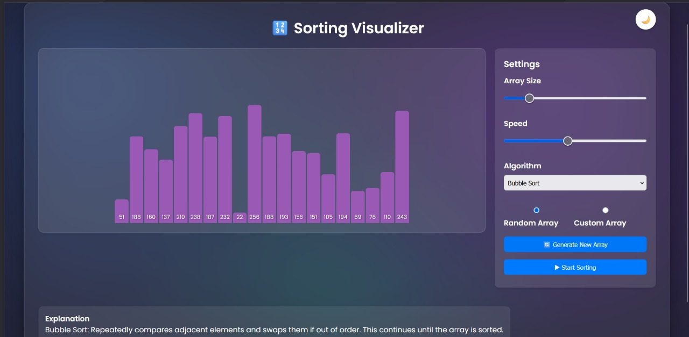

# 🔮 AlgoVisuals

**AlgoWhiz** is a modular and beginner-friendly visualizer for popular **algorithms**, starting with Sorting and expanding into Graphs.

Built using **HTML, CSS, and JavaScript**, this project aims to make algorithm learning visual, interactive, and intuitive.

---

## 🎯 Modules

### 📊 Sorting Visualizer

Visualizes how sorting algorithms work using animated bars.

#### ✅ Features:
- Custom & random array support
- Adjustable size and speed
- Explanations for each algorithm
- Dark mode toggle 🌙

#### 📌 Algorithms Included:
- Bubble Sort
- Selection Sort
- Insertion Sort
- Merge Sort
- Quick Sort

📁 Path: `Sorting/`

---

### 🧠 Graph Visualizer _(Coming Soon)_

Visual interface to understand and explore graph algorithms.

#### ⏳ Planned Features:
- Visualize BFS & DFS traversals
- Detect cycles in graphs
- Display shortest paths
- Custom graph input and drawing

📁 Path: `Graph/`

---
<p align="center">
  
</p>
<p align="center">
  
</p>


## 💻 How to Run

1. **Clone the repository**
   ```bash
   git clone https://github.com/thenamekavyasingh/algovisuals.git
   cd algovisuals

---

## 🙋‍♀️ Author

Made with ❤️ by [Kavya](https://github.com/thenamekavyasingh)  
_If you like it, consider ⭐ starring the repo!_
